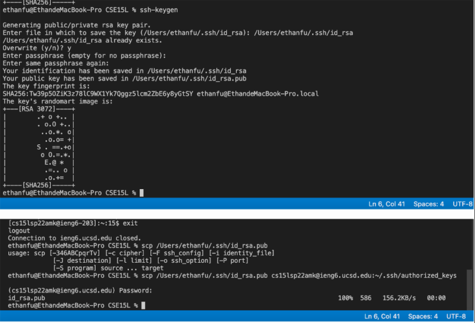
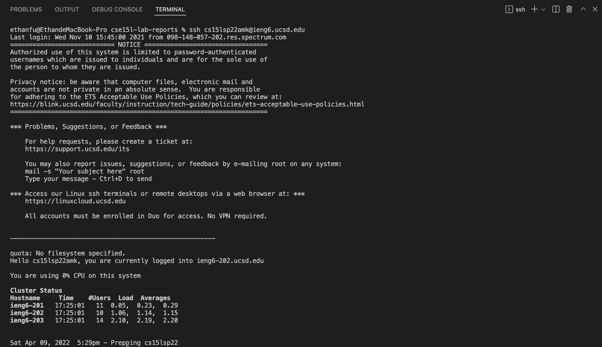
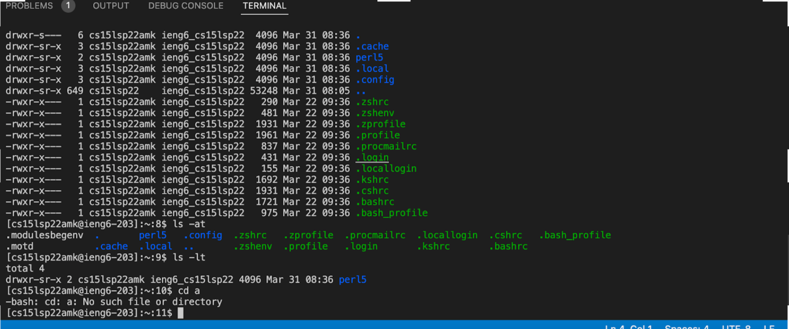
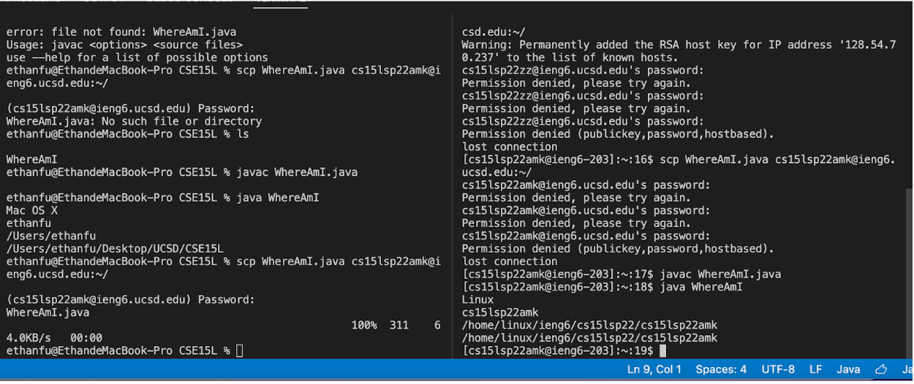
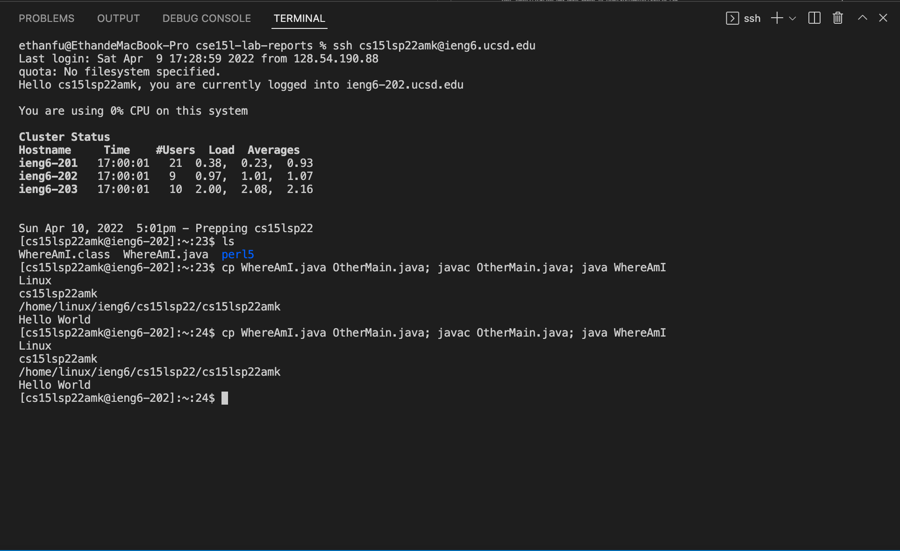

# Lab Report 1  

Install VScode by clicking the download button, and follow the instruction of the installation.

  

Remotely connecting to ucsd ieng6 server by commanding `ssh cs15lsp22amk@ucsd.edu`. Though now I don't need to type in my password on my current laptop, other devices which didn't apply keygen for my account need to type in the password to access the acount.    

`ls`: stands for *list files* present in the current directory.   
`ls -at`: list files(including ones with hidden directory) according to their modification time.   
`ls -lat`: list files(including ones with hidden directory) in long format according to their modification time.   
`cd`: stands for *change directory*, and it is the only way to navigate to a directory for admins.

  

Moving files with scp by calling `scp` with the filename and the account name. In this case, I was copying WhereAmI.java to my course specific folder, `cs15lsp22amk@ieng6.ucsd.edu`, using `scp`. Then, password is likely to be needed for the copying.  

To set up `ssh` keys, we need to type `ssh-keyge`n first in our terminal. Then, enter a file directory to where the key saves locally. Type `y` and create a paraphrase to proceed overwrite. At last, secure copy the public key from locally to the folder in class server. Once this is done, password is not needed for future `ssh` and `scp` from this client to the server.  

Less keystrokes/mouseclicks are needed when we can write several commands in the same line and and separate them by using semicolons. Also, up click is also useful for optimization when we need many repetitive commands.