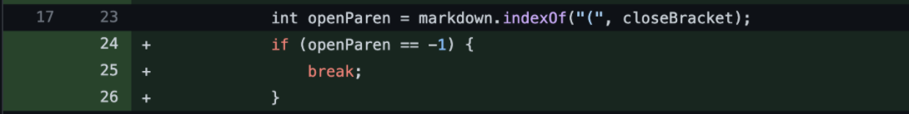
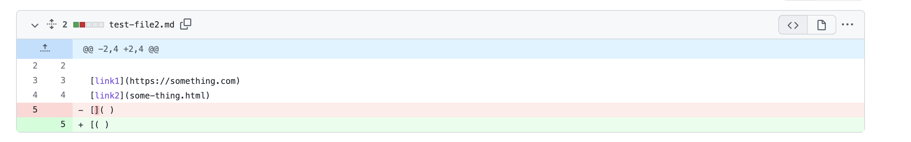
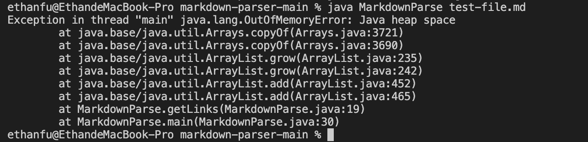
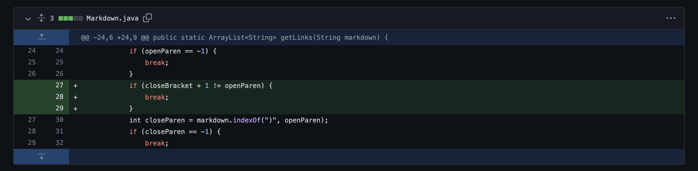
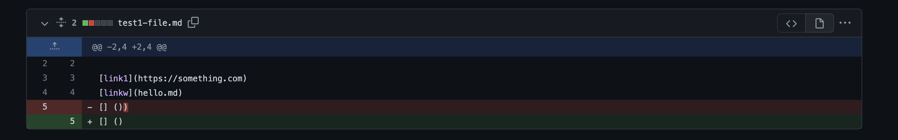

# Lab Report 2 :

## Code Change 1:

### Screenshot of Code Change:

### Failure Inducing Input:

### Output from Command Line:

### Description of the Bug:
In the failure inducing input, I deleted the closed bracket. A OutOfMemoryError occured when the program didn't end with a pair of bracket and parenthesis. Therefore, I added if statements in getLinks method to make sure the method only works for links within those patterns. Otherwise, it will break the while loop.

## Code Change 2:

### Screenshot of Code Change:

### Failure Inducing Input:

### Output from Command Line:

### Description of the Bug:
In the failure inducing input, I added a space between the close bracket and open parenthesis. A OutOfMemoryError occured when the pattern was not followed. Therefore, I added an if statement in getLinks method to make sure the method only works for the pattern where the next element of the close braket is the open parenthesis. Otherwise, it will break the while loop.
