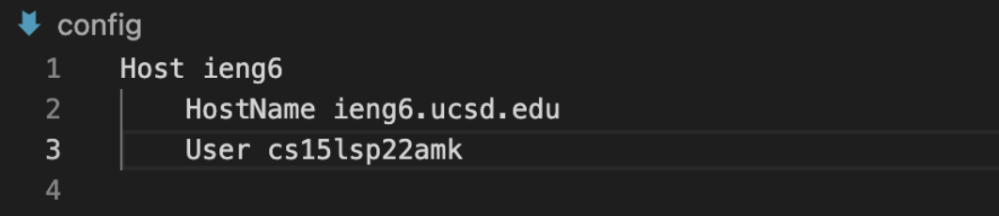
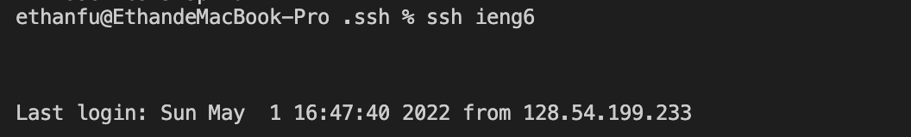
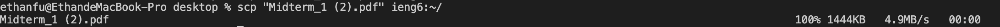
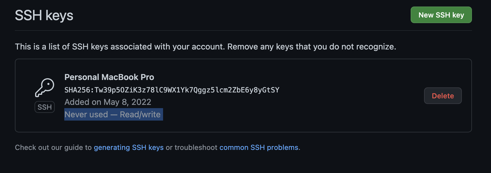
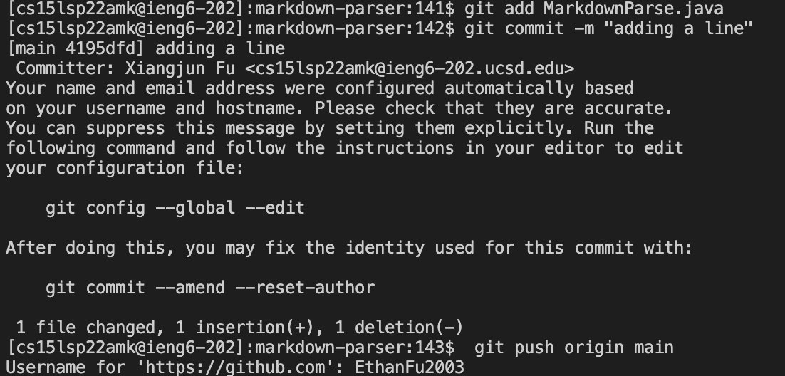

# Lab Report 2 :

## Streamlining ssh Configuration:

### Screenshot of .ssh/config File:

### Screenshot of ssh Command:

### Screenshot of scp Command:

## Setup Github Access from ieng6:

### Screenshot of public key:

### Screenshot of public key:

### Screenshot of public key:

### Commit Link:

## Copy whole directories with `scp -r`:

### 

