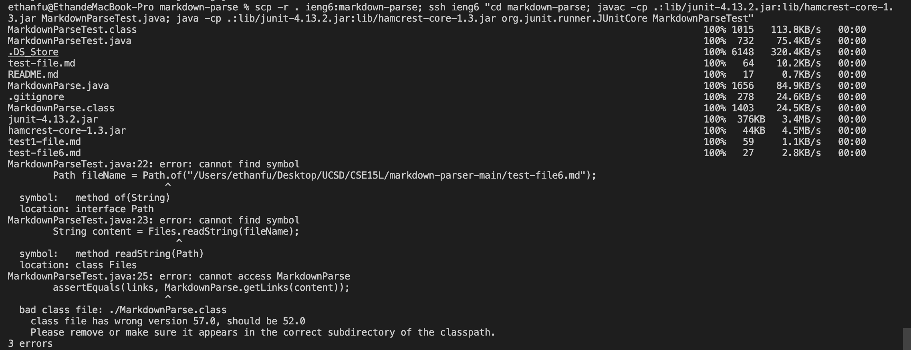

# Lab Report 3 :

## Streamlining ssh Configuration:

### Screenshot of .ssh/config File:

### Screenshot of ssh Command:

### Screenshot of scp Command:

## Setup Github Access from ieng6:

### Screenshot of public key:

### Screenshot of public key:

### Screenshot of public key:

### Commit Link:
[Commit Link](https://github.com/EthanFu2003/markdown-parser/commit/75db040466942b3ea04717a17d60225e548f76c4)

## Copy whole directories with `scp -r`:

### Screenshot of markdown-parse copying:

### Screenshot of tests ran on ieng6:

### Screenshot of running tests in one line:

