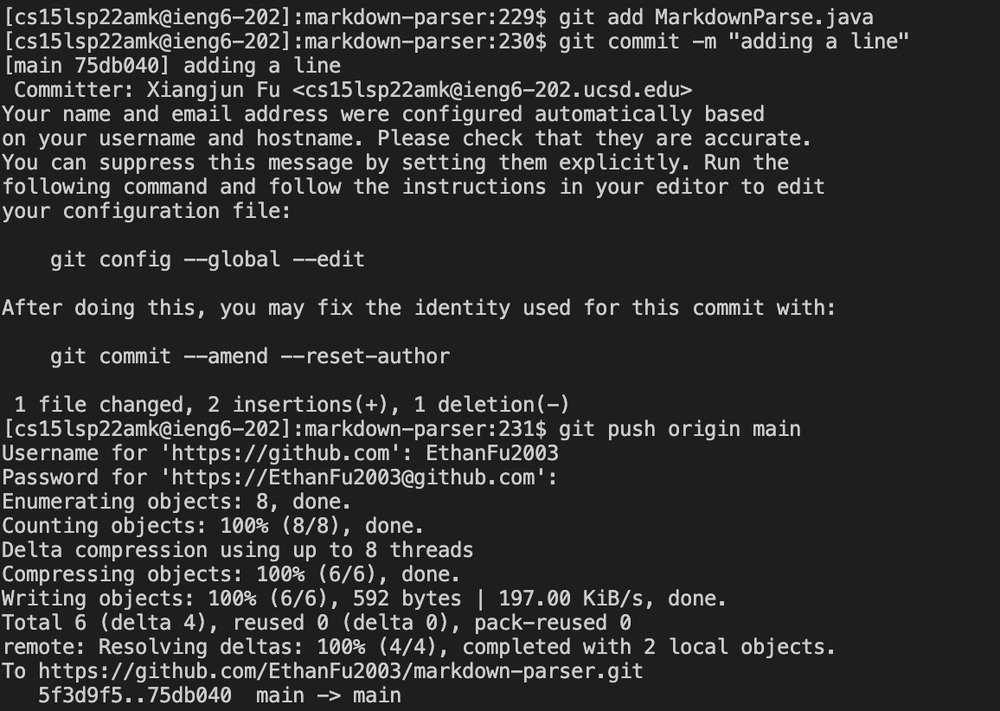
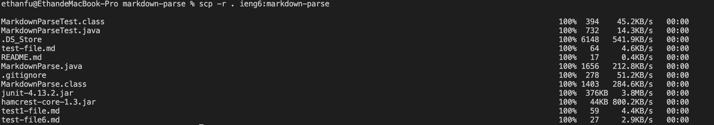
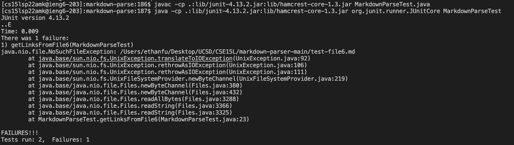
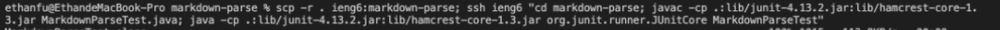

# Lab Report 3 :

## Streamlining ssh Configuration:

Creating the .ssh/config File and adding three command lines.

By typing `ssh ieng6` in the terminal, my computer logs me in with the username I specified.

Secure copying a file to my server account using just the alias.

## Setup Github Access from ieng6:

Finding the public key I stored in my server account, which, in this case, is within the `id_rsa.pub` file.

Storing the private key I made on my github account.

Commiting and pushing a change to github by using commands `add`, `commit`, and `push`.

[Commit Link](https://github.com/EthanFu2003/markdown-parser/commit/75db040466942b3ea04717a17d60225e548f76c4)

## Copy whole directories with `scp -r`:

Copying the entire markdown-parse file to my account using `scp -r` and my alias.

Logging in on my server account, and running the tests using JUnit.

Running `scp`, `ssh`, and all the tests in one line.

