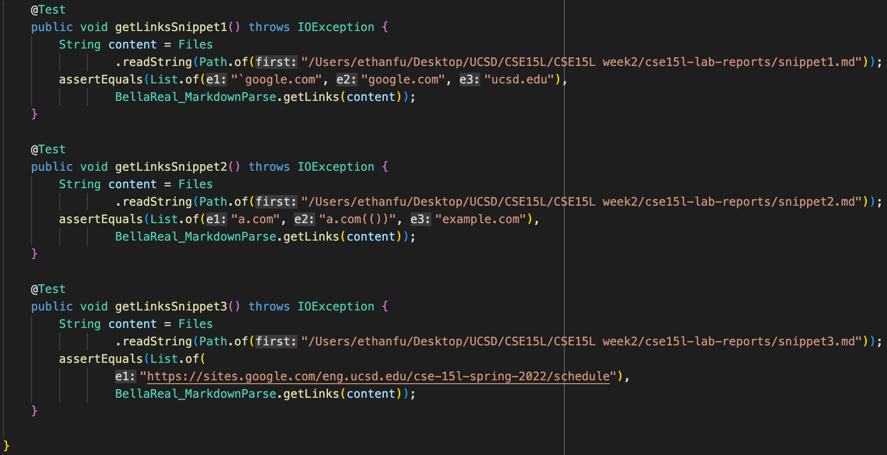

# Lab Report 4 :
### Below are two links to my MDP repo and my group reviewed in lab 7 respectively:

[My MarkdownParse Repository](https://github.com/EthanFu2003/markdown-parser)

[Reviewed MarkdownParse Repository](https://github.com/BellaReal/markdown-parser)

### Below are the test cases I added in both my repository and the repository we reviewed.

### Snippet 1

- The output when running the first JUnit test on my MarkdownParse.

- The output when running the first JUnit test on my group reviewed MarkdownParse.

### **How to Debug 1**
This case probably needs more than ten lines to fix since backtics needs to be in consideration. A lot of different scenarios need to be considered as some backtics might result in either valid or invalid links.

### Snippet 2

- The output when running the second JUnit test on my MarkdownParse.

- The output when running the second JUnit test on my group reviewed MarkdownParse.

### **How to Debug 2**
This case probably needs more than ten lines to fix since exceptions on additional parenthesis and nested links haven't been handled yet. There would need to be a loop to check for open parenthesis and close parenthesis throughout the file.

### Snippet 3

- The output when running the third JUnit test on my MarkdownParse.

- The output when running the third JUnit test on my group reviewed MarkdownParse.

### **How to Debug 3**
This case probably needs less than ten lines to fix. To check whether the link is in correct format, not only do we need to consider spaces between parenthesis, but entire lines should also be checked (maybe by using \n). Then, my MarkdownParse should continue and print out the entire link after the closed parenthesis.