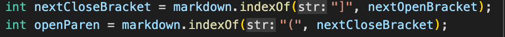
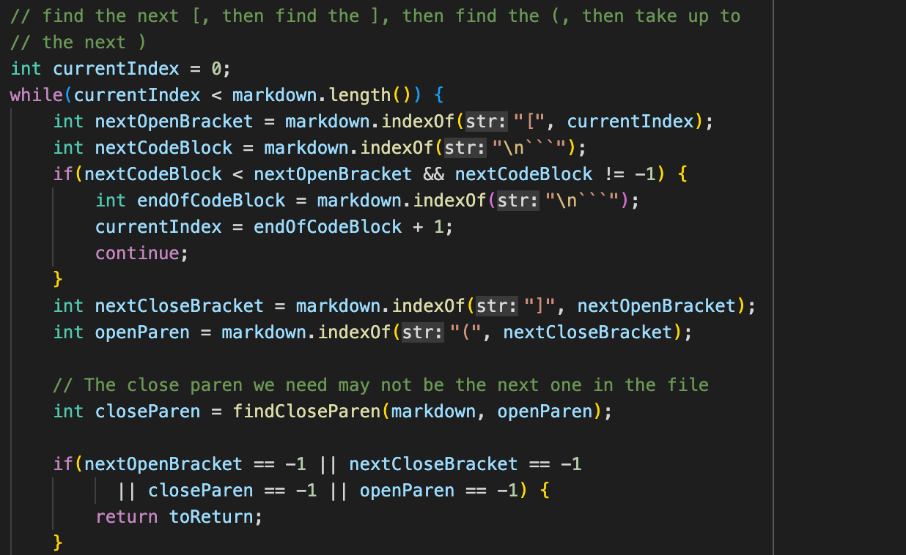

# Lab Report 5

## Overview
By using `vimdiff` on both `result.txt`, I am able to compare differences in output between two different `markdown-parser` files.

I would use test file 510 and 14 for demonstration in below sections.

## Test File 510
- Below is my group's code result for test file 510.
.png)
.png)
- Below is the example MarkdownParse result for test file 510.
.png)
.png)
[Test 510](https://github.com/nidhidhamnani/markdown-parser/blob/main/test-files/510.md)

### Expected output: `[]`
In this case, my group's implementation is correct, and lab 9's implementation is wrong since an additional link (/uri) is within the output bracket. 

### Debug process:

Lab 9's implementation does not account for the case when close bracket and open parenthesis are more than one index apart. Therefore, an additional condition can be added to the program by checking `if (openParen - nextCloseBracket == 1)`.

## Test File 14
- Below is my group's code result for test file 14.
.png)
.png)
- Below is the example MarkdownParse result for test file 14.
.png)
[Test 14](https://github.com/nidhidhamnani/markdown-parser/blob/main/test-files/14.md)

### Expected output: `[]`
In this case, both my group's implementation and lab 9's implementation fail since we didn't take the escaping key `\` into consideration.

### Debug process:

Take Lab 9's implementation for example. It does not account for the scenario when backslash is used as a key to generate literal characters. Therefore, an additional condition should be added to the program to account for that, and using `if (markdown.charAt.(nextOpenBracket - 1) != "\")` can be one of the solutions.